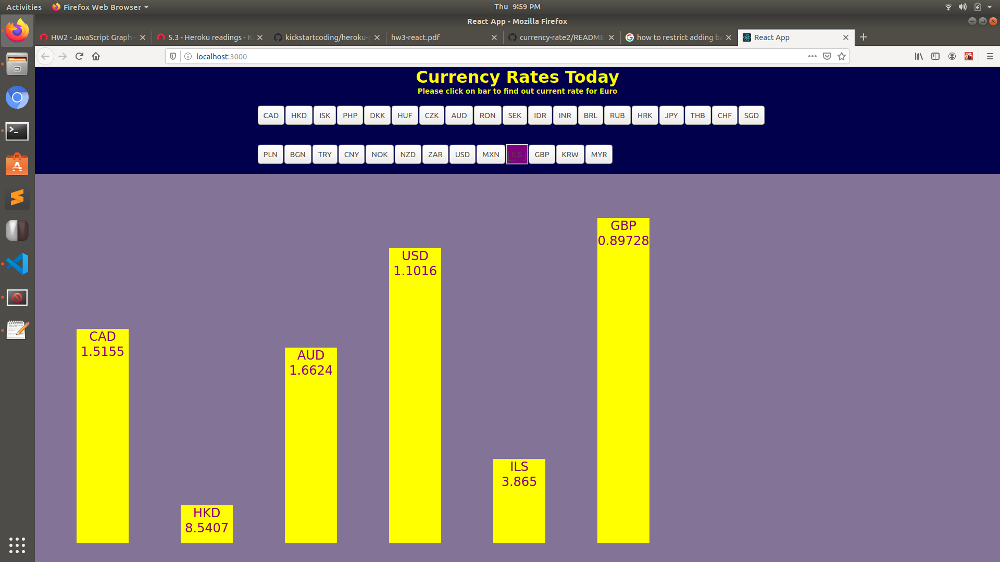

# currency-rate3

This is homework 3 for the Kickstart Coding front-end curriculum.

It is a bar graph with of the currency rate from data fetched from the exchange rates API. React JS is applied for a degree of interaction when base currency is changed.

API: https://api.exchangeratesapi.io/latest

Clicking on a currency abbreviation will populate a bar inside the bar container along with the default bars already inside. Clicking on a an abbreviation existing will cause the bar to disappear.

Here is a screenshot of the bar graph in action.

